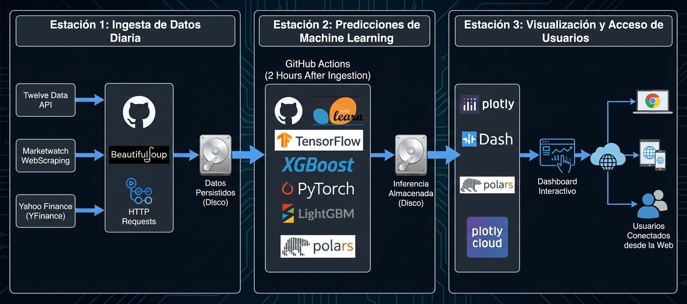

# 📡 Ingesta de Datos Diaria (Estación 1)


Este repositorio es el motor fundamental del ecosistema **Pro-Machinne**. Su función principal es la **Estación 1: Ingesta de Datos Diaria**, encargada de recopilar, limpiar y persistir la información histórica y actual de diversos instrumentos financieros para alimentar los modelos de predicción.

---

## 🏗️ Arquitectura del Proyecto (El Flujo)

El proyecto completo se divide en **3 estaciones independientes** que trabajan de forma coordinada:

1.  **Estación 1: Ingesta de Datos (Este Repositorio)**: Realiza el scraping y consultas API diariamente para mantener los datasets actualizados.
2.  **Estación 2: Inferencia de Predicciones**: Repositorio [`Inferencias_instrumentos_dic_2025`](https://github.com/aliskairraul/Inferencias_instrumentos_dic_2025). Procesa los datos con Deep Learning.
3.  **Estación 3: Dashboard de Backtesting**: Repositorio [`MachinneLearningBacktesterDic2025`](https://github.com/aliskairraul/MachinneLearningBacktesterDic2025). Visualiza los resultados en un tablero de Plotly Cloud.


*Diagrama de interacción entre los 3 repositorios.*

---

## 📈 Instrumentos Financieros Monitoreados

Mantenemos actualizado el histórico diario de los activos clave:

*   **BTC/USD**: Bitcoin frente al dólar estadounidense.
*   **EUR/USD**: El par de divisas más operado del mundo.
*   **S&P 500 (SPX)**: Índice de las 500 empresas más grandes de EE.UU.
*   **Oro (XAU/USD)**: El principal activo refugio.
*   **US10Y**: Rendimiento del bono del Tesoro a 10 años de EE.UU. (Data auxiliar).

---

## 🛠️ Stack Tecnológico

Hemos optimizado el proceso de ingesta utilizando herramientas de alto rendimiento:

*   **Polars**: Para un procesamiento de datos (ETL) extremadamente rápido y eficiente en memoria.
*   **YFinance**: Extracción de datos financieros de Yahoo Finance.
*   **TwelveData API**: Fuente secundaria para validación de datos en tiempo real.
*   **BeautifulSoup4**: Web scraping para fuentes que no disponen de API pública.
*   **GitHub Actions**: Automatización total de la ejecución diaria (Cron Jobs).

---

## ⚙️ Estructura del Proyecto

```text
├── .github/workflows/    # Automatización de GitHub Actions
├── assets/               # Imágenes y recursos visuales
├── db/                   # Datasets persistidos en formato Parquet
├── utils/                # Loggers y herramientas de soporte
├── main.py               # Script principal de ejecución
├── .env                  # Variables de entorno (API Keys)
└── requirements.txt      # Dependencias del proyecto
```

---

## 🚀 Ejecución y Configuración

### 1. Configuración del Entorno
```bash
python -m venv venv
source venv/bin/activate  # En Windows: venv\Scripts\activate
pip install -r requirements.txt
```

### 2. Variables de Entorno
Cree un archivo `.env` en la raíz con su API Key de TwelveData:
```text
API_KEY=tu_api_key_aqui
```

### 3. Ejecución Manual
```bash
python main.py
```

> [!NOTE]
> Este proceso se ejecuta automáticamente mediante **GitHub Actions** todos los días a las 01:00 UTC, realizando el commit de los datos actualizados directamente a la carpeta `db/`.

---

## 📊 Formato de Datos

Los datos se almacenan en archivos **Parquet**, lo que garantiza una compresión superior y una velocidad de lectura hasta 10 veces mayor que el CSV tradicional. Cada archivo sigue este esquema:
*   `date`: Fecha (YYYY-MM-DD).
*   `open`, `high`, `low`, `close`: Precios OHLC.
*   `symbol`: Identificador del instrumento.

---

## 🤝 Contacto y Portafolio

*   **LinkedIn**: [Aliskair Rodriguez](https://www.linkedin.com/in/aliskair-rodriguez-782b3641/)
*   **GitHub**: [@aliskairraul](https://github.com/aliskairraul)
*   **Email**: [aliskairraul@gmail.com](mailto:aliskairraul@gmail.com)
*   **Web/Portfolio**: [aliskairraul.github.io](https://aliskairraul.github.io)

---
*Desarrollado con ❤️ para la democratización de datos financieros y el análisis algorítmico.*
